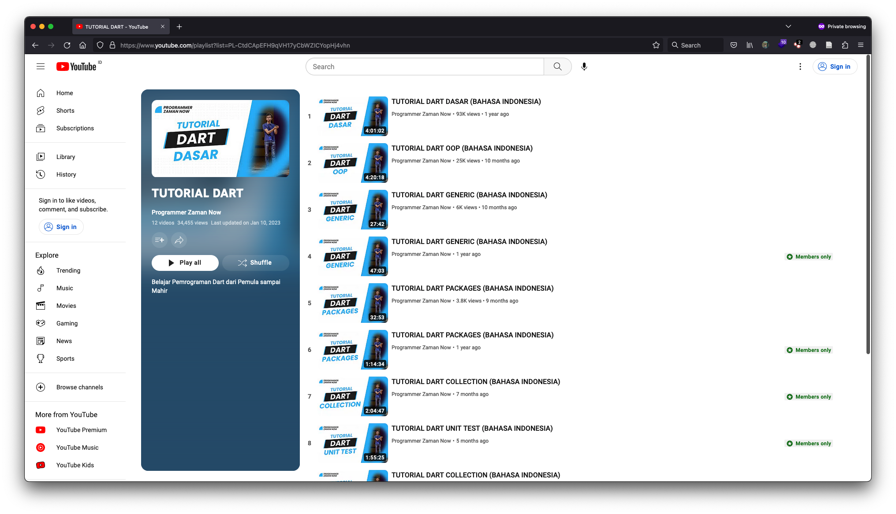

# Mastering Dart

## This only repo for teach for everyone want learn about dart basic

### list of chapters
---
1. [Create Dart App](docs/1_create_app.md)
2. [Hello World Program](resource/apps/basic_dart/README.md)
3. [Variable](docs/3_variable.md)
4. [Comment](docs/4_comment.md)
5. [Number](docs/5_number.md)
6. [Boolean]()
7. [String]()
8. [Dynamic]()
9. [Data Type Conversion]()
10. [Arithmetic Operator]()
11. [Comparison Operator]()
12. [Assignment Operator]()
13. [Logical Operator]()
14. [Type Test Operator]()
15. [List]()
16. [Set]()
17. [Map]()
18. [Symbol]()
19. [If & Else]()
20. [Switch Case]()
21. [Null]()
22. [Ternary Operator]()
23. [Null Safety]()
24. [For Loop]()
25. [While Loop]()
26. [Do While Loop]()
27. [Break & Continue]()
28. [For In]()
29. [Function]()
30. [Function Parameter]()
31. [Optional Parameter]()
32. [Named Parameter]()
33. [Function Return Value]()
34. [Function Short Expression]()
35. [Inner Function]()
36. [Main Function]()
37. [Higher Order Function]()
38. [Anonymous Function]()
39. [Scope]()
40. [Closure]()
41. [Recursive Function]()

# Reference

* Website [English]:
  * [Documentation](https://dart.dev/guides/)

* Youtube Channel [Bahasa] :
  * Programmer Zaman Now => https://www.youtube.com/c/ProgrammerZamanNow
      * playlist
      
  * Erico Darmawan Handoyo => https://www.youtube.com/@ericodarmawan
  * Kuldii Project => https://www.youtube.com/@KuldiiProject

* Powerpoint [Bahasa]:
  * [Slide](https://docs.google.com/presentation/d/1h2TPQtSXoPaLlP9kXwLJWUUr4KLbdWtOBiWvDl0DB1E/edit?usp=sharing)