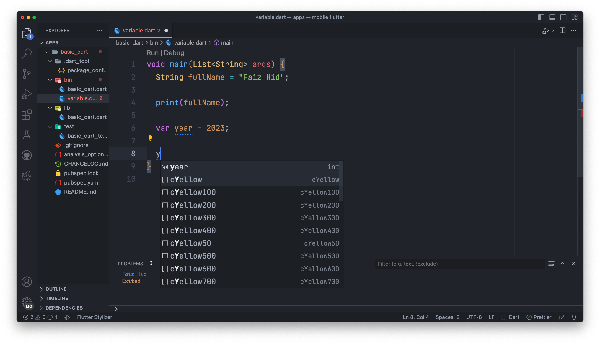

## Variable

- Variable is a place to store data, there are a lot of data types in Dart, we will discuss them in separate materials.
- Variables are very useful when we want to use the same data many times, instead of making it over and over again, it is better to store the data in a variable.
- Variables must have a data type and variable name, when we want to access the variable, we just need to mention the variable name.

### how to declare variable
* you can use ```DataType VariableName``` for declare variable, but in this code you can change.
#### example code
```dart
void main(List<String> args) {
  String fullName = "Faiz Hid";

  print(fullName);
}
```

## ```var```
### next, in other version, you can use ```var``` for declare dynamic data type. But in this case only about ```var``` other chapter about ```Dynamic``` data type.

- we can sea, use ```var``` can use variable type use integer like this



## ```final```
### use ```final``` for declare variable for use some data you didn't redeclare in same variable name, and show error if you declare again, but body / content can edit

#### example code
```dart
void main(List<String> args) {
  final species = 'ningen';

  print(species);

  final species = 'tori';
}
```


## ```const```
### immutable variable. cannot modify in variable name or body
#### example code
```dart
void main(List<String> args) {
  const yourAge = 63;
  print(yourAge);
}
```

## ```late```
* In Dart, by default, variables will be declared when they are created.
* But sometimes there are cases where we want the variable to be declared later, when it is accessed, if it is not accessed, it does not need to be declared.
* To do this, we can add the keyword late at the beginning of the variable declaration

#####<b>```with late```</b>


#####<b>```without late```</b>
