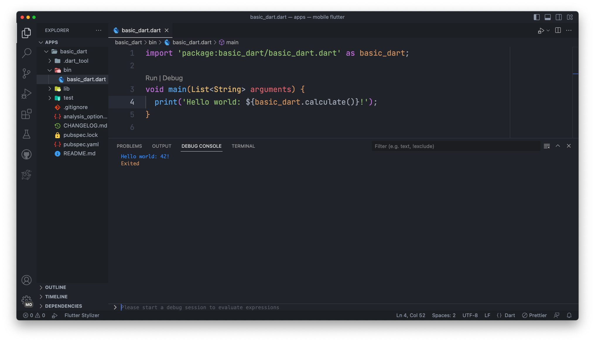

A sample command-line application with an entrypoint in `bin/`, library code
in `lib/`, and example unit test in `test/`.


### code
```dart
import 'package:basic_dart/basic_dart.dart' as basic_dart;

void main(List<String> arguments) {
  print('Hello world: ${basic_dart.calculate()}!');
}
```

## open project in your IDE or Text Editor

```running like this```




# that's simple, because begining your learning about dart😂😂😂